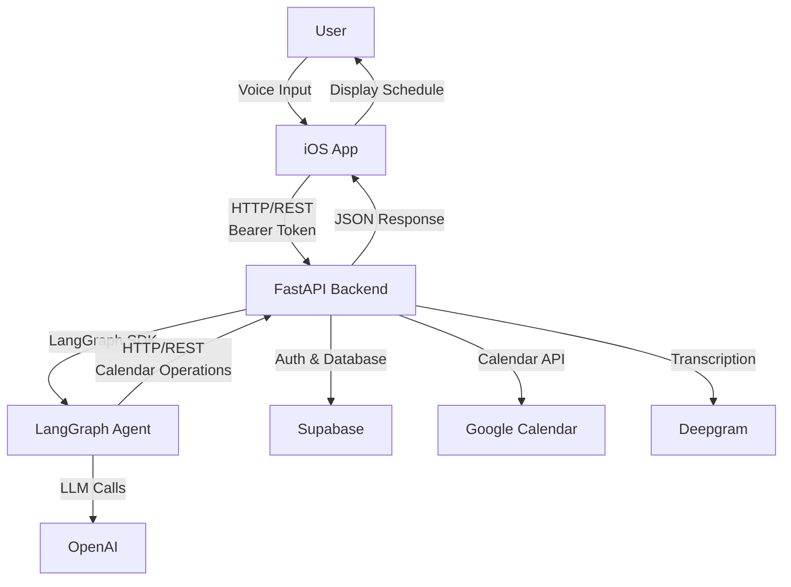

# Noon

Noon is a voice-powered calendar scheduling assistant that allows users to interact with their Google Calendar through natural language voice commands. Users record audio queries, which are transcribed and processed by an AI agent to perform calendar operations like viewing schedules, creating events, updating events, and deleting events.

## App Architecture

Noon consists of three main components:

- **iOS App**: SwiftUI-based mobile application for user interaction
- **Backend**: FastAPI service handling authentication, transcription, and calendar operations
- **Agent**: LangGraph-based AI agent that processes natural language queries

## Components

### iOS

The iOS app provides the user interface for voice-based calendar interaction. Users can record voice commands, view their schedules, and manage calendar events through an intuitive SwiftUI interface.

See [ios/README.md](ios/README.md) for setup and run instructions.

### Backend

The backend API handles authentication via Supabase, audio transcription using Deepgram, Google Calendar integration, and serves as the orchestration layer between the iOS app and the agent service.

See [backend/README.md](backend/README.md) for setup and run instructions.

### Agent

The agent is a LangGraph-based AI system that processes natural language calendar queries using OpenAI. It interprets user intent, extracts relevant information, and performs calendar operations through a set of tools.

See [agent/README.md](agent/README.md) for setup and run instructions.
